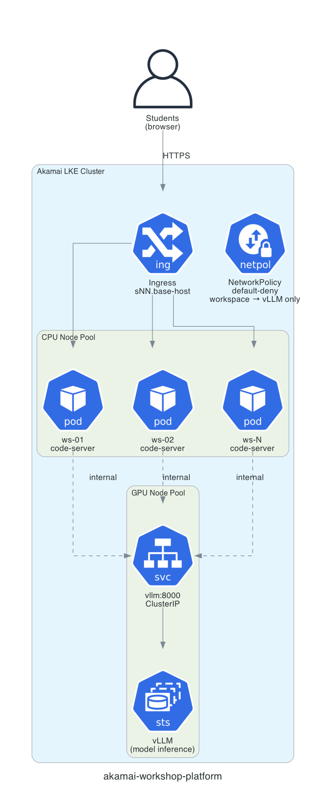

# akamai-workshop-platform

`akamai-workshop-platform` provisions a per-student GPU workshop classroom on [Akamai Cloud](https://www.linode.com/) (Linode LKE) with one interactive wizard, then tears it down with one command. The platform provides the core infrastructure: per-student browser IDEs ([code-server](https://github.com/coder/code-server)), GPU [vLLM](https://github.com/vllm-project/vllm) inference, student URLs and passwords, TLS, and Kubernetes networking. You point it at any content repo, answer about five questions, confirm a cost preview, and get a running classroom plus a CSV of student URLs and passwords.

The [AI-agents workshop](https://github.com/akamai-developers/ai-agents-workshop) is the default content, not the product. Any content repo works.

## Prerequisites

**Account:**

- Create an [Akamai Cloud account](http://login.linode.com/signup?promo=akm-dev-git-300-31126-M055) with an API token (includes free credit). Export the token before you deploy: `export TF_VAR_token="your-linode-api-token"`. The wizard reads it from `$TF_VAR_token` or `$LINODE_TOKEN` — the two are interchangeable and you only need one. If both are set, each is checked against the Linode API and the first working token wins (`$TF_VAR_token` preferred), so a stale token left in your shell profile is skipped instead of breaking the deploy. The token is never written to a file. Scopes: easiest is full access; the minimum is Read/Write on Kubernetes, Linodes, Firewalls, NodeBalancers, Volumes, and (domain mode) Domains.

**Tools:**

- [Terraform](https://terraform.io) version 1.5 or later
- [kubectl](https://kubernetes.io/docs/tasks/tools/)
- `bash`, `python3`, and `openssl`, which are standard on macOS and Linux

You do not need a HuggingFace token, because the model menu is ungated only. You do not need Docker or a registry login.

## Architecture

<p align="center">
  
</p>

## What it does

- **Self-service:** an interactive wizard collects the student count, model, content repo, domain, and region.
- **Autopilot sizing:** the wizard picks the GPU plan, tensor-parallel size, and replica and node counts from the student count and model, then shows a `$/hr` and class-cost preview before anything bills.
- **Content-agnostic:** the platform clones your `content_repo` into each workspace at pod startup, with no image rebuild and no registry login. See [`examples/README.md`](examples/README.md).
- **Domain-optional:** with no domain, the platform uses `sslip.io` hostnames and self-signed TLS (the default). With a domain, it uses Linode DNS and a Let's Encrypt wildcard certificate.
- **Live region and capacity check:** the wizard discovers GPU-capable regions and validates GPU capacity before provisioning, so a capacity shortage never leaves a partially built cluster that keeps billing.
- **Private inference:** vLLM and the multi-model agentgateway stay cluster-internal behind ClusterIP services and a default-deny NetworkPolicy. Off-cluster access uses `kubectl port-forward` only, with no public endpoint. Multi-model deployments also require an API key on the gateway.

## Quick start

This path uses no domain, so the platform serves `sslip.io` hostnames with self-signed TLS.

```bash
export TF_VAR_token="your-linode-api-token"

# See the plan and cost first. This creates nothing:
./deploy.sh --dry-run --students 80 --model Qwen/Qwen3-8B-FP8

# Interactive: asks for students, model, content repo, domain, and region,
# shows a cost preview, provisions the classroom, then writes access-cards.csv:
make deploy            # or: ./deploy.sh

# Tear it down when class ends. This stops billing:
make teardown          # or: ./deploy.sh teardown
```

After the deploy finishes, you can view student URLs and passwords in three ways:

```bash
# View the raw CSV
cat infra/manifests/generated/access-cards.csv

# Generate printable HTML cards (one per student, ready to cut and hand out)
./infra/scripts/print-access-cards.sh
open infra/manifests/generated/access-cards.html
```

The CSV contains one row per student with `student_number`, `url`, and `password` columns.

For non-interactive runs (CI or scripted), copy `config.example.yaml` to `config.yaml`, edit it, then run:

```bash
./deploy.sh --yes --config config.yaml
```

Run `make help` to list every front-door target.

!!! warning
    GPU nodes bill by the hour. Always run `make teardown` (or `./deploy.sh teardown`) when class ends, so the cluster stops billing.

## Inputs

These five inputs are the entire user surface. Anything you omit is filled by the wizard's autopilot.

| Input | Default | Meaning |
|---|---|---|
| `students` | required | Number of student workspaces to create |
| `model` | `Qwen/Qwen3-8B-FP8` | Any ungated HuggingFace model id, or comma-separated ids for multi-model (e.g. `"Qwen/Qwen3-8B-FP8,Qwen/Qwen3-14B-FP8"`). Run `make models` to list the catalog, or type `list` at the wizard's model prompt. |
| `content_repo` | `""` | Git repo cloned into each workspace at startup. Blank uses `akamai-developers/ai-agents-workshop`. Also accepts a full git URL, `owner/repo`, or a bare repo name. |
| `domain` | `""` (no domain) | Empty uses `sslip.io` and self-signed TLS. A value uses Linode DNS and Let's Encrypt. |
| `region` | nearest GPU region | Chosen from the live list of GPU-capable Akamai regions |

## TLS and domains

The preferred method is to bring your own domain. When you provide a domain, the platform creates Linode DNS records and provisions a free Let's Encrypt wildcard certificate automatically. Students get trusted HTTPS with no browser warnings.

```bash
./deploy.sh deploy --domain example.com
# Students get: https://s01.workshop.example.com/
```

If you deploy without a domain (the default), the platform uses [sslip.io](https://sslip.io) for DNS. sslip.io is a free public DNS service that maps hostnames like `172-238-62-203.sslip.io` to the embedded IP address. This gives each student a unique subdomain for ingress routing without any domain purchase or DNS configuration.

Because you do not control the `sslip.io` DNS zone, the platform cannot complete a Let's Encrypt DNS-01 challenge. It falls back to a self-signed certificate instead. The connection is still encrypted, but browsers show a "Not Secure" warning. Students accept the warning once and proceed normally.

!!! note
    For production or customer-facing workshops, use a real domain. For internal testing or instructor-led sessions where you can walk students through the browser warning, sslip.io works fine.

## Multi-model deployments

The platform can deploy two or more models behind a single endpoint. When you select multiple models (comma-separated), the platform provisions independent GPU node pools per model and deploys [agentgateway](https://agentgateway.dev) as a lightweight routing proxy. Students use one `VLLM_HOST` and select the model with the standard `model` field in their API requests, with no code changes.

```bash
# Dry-run: see per-model GPU breakdown, gateway routing, and total cost
./deploy.sh --dry-run --students 40 --model "Qwen/Qwen3-8B-FP8,Qwen/Qwen3-14B-FP8"

# Deploy with multiple models
./deploy.sh --students 40 --model "Qwen/Qwen3-8B-FP8,deepseek-ai/DeepSeek-R1-0528-Qwen3-8B"
```

In `config.yaml`, use the `models:` key instead of `model:`:

```yaml
models: "Qwen/Qwen3-8B-FP8,Qwen/Qwen3-14B-FP8"
```

Single-model deployments are unchanged: no gateway is deployed, and `VLLM_HOST` points directly to vLLM. Multi-model adds an agentgateway Deployment that reads the `model` field from the JSON request body and routes to the correct `vllm-<slug>:8000` backend. See [`infra/docs/architecture.md`](infra/docs/architecture.md) for the routing diagram.

### API-key authentication

Multi-model deployments require an API key, because students share one gateway. The platform mints a key at deploy time, stores it in the `gateway-api-keys` Secret (agentgateway `apiKeyAuthentication`, mode `Strict`), and injects it into every workspace as `VLLM_API_KEY`. Clients send it as `Authorization: Bearer`, so students do nothing. The key is printed in the "Classroom ready" summary.

The gateway routes requests; it does not act as a passthrough, so it does not serve `GET /v1/models`. List the available models in one of two ways:

```bash
echo $MODEL_NAMES                              # inside a workspace
kubectl -n workshop get agentgatewaybackends   # from the cluster
```

!!! note
    The workshop uses a single shared key, which is fine for a time-boxed class. For production, issue one key per identity and add key rotation.

## Component model

The five inputs above provision the **default** workshop shape: a browser code-server
per student plus one shared vLLM endpoint. Different workshops are composed from a
catalog of independent, per-student **components** — selected once per classroom in the
config file (the interactive wizard never prompts for them). Every component defaults to
today's behavior, so a deploy that sets none of them is byte-identical to the original
platform.

| Component | Values (default first) | Controls |
|---|---|---|
| `editor` | `code-server` \| `jupyter` | The workspace UI |
| `inference` | `shared-vllm` \| `dedicated-vllm` \| `external` | Where the model comes from |
| `gpus_per_student` | `1` | GPUs for `dedicated-vllm` (2 reserved for v2) |
| `cluster_access` | `none` \| `scoped` | Per-student namespace + scoped kubeconfig + NetworkPolicy (in-notebook `kubectl`) |
| `object_storage` | `none` \| `managed` | Per-student bucket + bucket-scoped key |
| `agent_deploy` | `none` \| `plain` | Ship the student's agent to their namespace (requires `cluster_access: scoped`) |

```yaml
# config.yaml — an "own your inference" workshop
editor:           jupyter
inference:        dedicated-vllm
cluster_access:   scoped
```

```bash
./deploy.sh deploy --config config.yaml      # or --editor jupyter --inference dedicated-vllm ...
```

Two ready-made compositions ship in [`examples/`](examples/):

```bash
# Own-your-inference: jupyter + a dedicated, under-tuned vLLM per student to tune via kubectl
make deploy ARGS="--config examples/own-inference.yaml"

# SA-agent: jupyter + scoped kubectl + a managed per-student bucket + ship-the-agent capstone
make deploy ARGS="--config examples/sa-agent.yaml"
```

Verify without provisioning anything:

```bash
make verify-default                                  # the default path is byte-identical
make verify-config CONFIG=examples/own-inference.yaml # a composed config dry-runs cleanly
```

When `cluster_access: scoped` or `object_storage: managed` is set, each printed access card
also notes the student's namespace and that their kubeconfig / bucket is pre-wired (no secret
material on the card). See `config.example.yaml` for the full catalog and [`PLAN.md`](PLAN.md)
for the design.

## Cost

GPU nodes bill by the hour, and the wizard prints an estimate before you confirm. A typical 80-student class (`Qwen3-8B-FP8` on 5 `g2-gpu-rtx4000a4-s` GPU nodes plus 5 CPU nodes) costs roughly **$15.88/hr**, or about $64 for a 4-hour class. A single-GPU capacity-probe box (one `g2-gpu-rtx4000a1-s` GPU node plus one CPU node) costs about $0.74/hr.

For the full breakdown, the sizing formula, and the GPU-plan decode, see [`infra/docs/cost.md`](infra/docs/cost.md) and [`infra/docs/sizing.md`](infra/docs/sizing.md).

## Documentation

- [`PLATFORM-PLAN.md`](PLATFORM-PLAN.md): the full design blueprint
- [`infra/README.md`](infra/README.md): infrastructure details
- [`infra/docs/quickstart.md`](infra/docs/quickstart.md): step-by-step deploy, port-forward, and teardown
- [`infra/docs/architecture.md`](infra/docs/architecture.md): the layers, the Helm chart, and what each value controls
- [`infra/docs/sizing.md`](infra/docs/sizing.md): GPU-plan decode, the sizing formula, model catalog, and regions
- [`infra/docs/cost.md`](infra/docs/cost.md): the `$/hr` breakdown and how to keep the bill down
- [`examples/README.md`](examples/README.md): default content and how to bring your own
- [`infra/docs/runbook.md`](infra/docs/runbook.md), [`infra/docs/security.md`](infra/docs/security.md), and [`infra/docs/troubleshooting.md`](infra/docs/troubleshooting.md): operations, security posture, and troubleshooting

## About the Author

>This project was created by **Du'An Lightfoot**, a developer passionate about AI agents, cloud infrastructure, and teaching in public.
>
>Learn more and connect:
>- 🌐 Website: [duanlightfoot.com](https://duanlightfoot.com)
>- 📺 YouTube: [@LabEveryday](https://www.youtube.com/@LabEveryday)
>- 🐙 GitHub: [@labeveryday](https://github.com/labeveryday)
